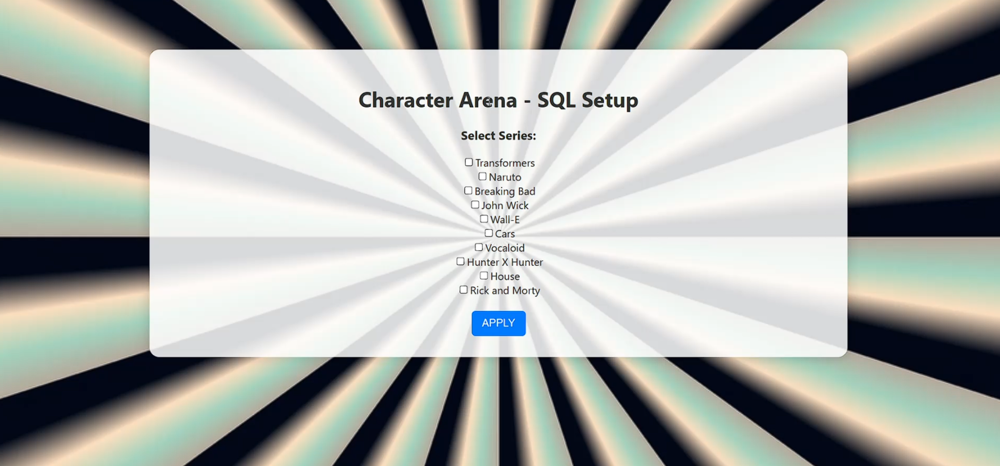
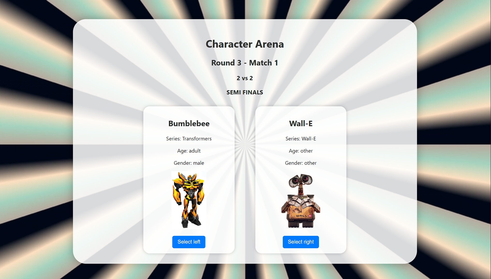

# Character Arena

Character Arena is a full-stack tournament-style web game where users choose one or more series and vote through random character matchups until a final champion is determined.

Built with **React**, **Flask**, and **MySQL**, the project combines frontend interaction, backend game logic, and database-driven character selection in a dynamic elimination-style format.

## Preview

### Series Selection Interface
Users can choose which series to include before generating tournament matchups.



### Tournament Matchup Interface
Matchup screen showing two randomly selected characters from the user-chosen series, with elimination-based voting to advance the winner.



## Technologies Used

- **Frontend:** React
- **Backend:** Python (Flask)
- **Database:** MySQL
- **Image Search / Collection:** DuckDuckGo script for downloading image data

## Features

- Select one or more series before starting the tournament
- Generate random matchups from the selected series
- Progress through elimination rounds with user voting
- Track the tournament until a final winner is determined
- Pull character data dynamically from a MySQL database

## How It Works

1. **Start Screen**  
   Users read how the game works and begin the tournament.

2. **Series Selection Screen**  
   Users select one or more series from the database.

3. **Game Screen**  
   Characters are matched in random head-to-head battles, and the user chooses a winner for each round.

4. **Winner Screen**  
   The final champion is displayed after all elimination rounds are completed.

## Project Structure

```text
character-arena/
├── backend/            # Flask API for game logic and database interaction
│   └── app.py
├── database/           # MySQL schema and character data
│   └── init.sql
├── frontend/           # React application
│   ├── public/
│   └── src/
├── preview.png
├── preview_series_selection.png
└── README.md
```

## Getting Started

### 1. Clone the repository

```bash
git clone https://github.com/giraydorukyurt7/CHARACTER-ARENA.git
cd CHARACTER-ARENA
```

### 2. Start the Flask backend

```bash
cd backend
python app.py
```

### 3. Start the React frontend

```bash
cd frontend
npm install
npm start
```

### 4. Open the app

Visit:

```text
http://localhost:3000
```

## Notes

- Make sure MySQL is running and your credentials match the local setup.
- Character data is pulled dynamically from the database.
- If an image is missing, a fallback image can be used.
- The project was tested in a modern browser environment.

## Contact

Built by **Giray Doruk Yurtseven**
